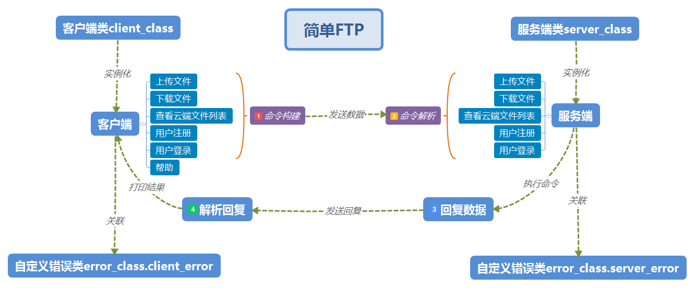

# 简单FTP

--------

 - 使用子进程同时启动服务端和客户端

 - 实现FTP简单功能，仅支持单用户连接

 - 测试账号：`admin`密码：` admin`，未提供注册功能

 - 程序结构

   ```
   简单FTP
       ├─bin
       │      simple_ftp.py#客户端服务端一键启动
       │      __init__.py
       │      
       ├─config
       │      config.ini#配置文件
       │      __init__.py
       │      
       ├─core
       │      client_class.py#客户端类
       │      error_class.py#自定义错误类
       │      server_class.py#服务端类
       │      __init__.py
       │      
       ├─db#用户数据
       │      user_admin.dat
       │      __init__.py
       │      
       └─home
          └─admin#用户目录
                  1_1.dat
                  2_2.dat
                  
       
   ```

   

----------


## About Me
```python
myname = 'MC.Lee'
mylink = 'limich.cn'
```
[我的博客](https://limich.cn)
QQ:289959141
E-mail:limich@aliyun.com

[代码GitHub地址](https://github.com/limingchang/python_study_task.git)

[代码国内码云同步地址](https://git.oschina.net/limich/python_study.git)