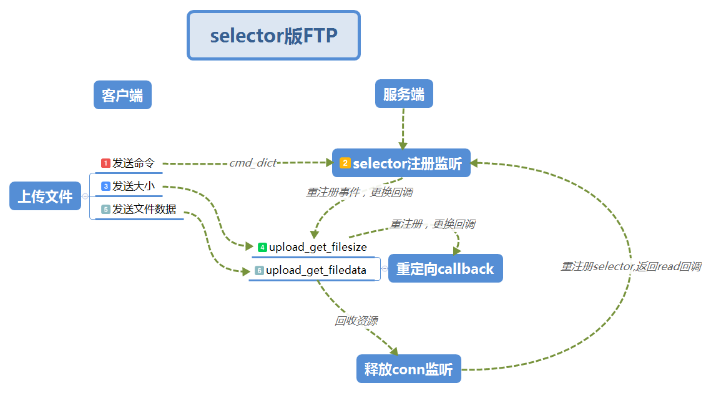

# selectors版简单FTP


## 实现功能

1. 用selector实现简单的并发版FTP
2. 允许多用户上传下载


------

## 文件结构

- 程序较为简单，因此未按标准结构设计
- server和client目录下各有一个`conf.ini`文件存储配置信息
- `ftp_client.py`和`ftp_server.py`分别是客户端类和服务端类

----

## 流程图



- 通过每一步的重注册selector来更换回调，使每次conn活动得到处理

------

## About Me
```python
myname = 'MC.Lee'
mylink = 'limich.cn'
```
[我的博客](https://limich.cn)
QQ:289959141
E-mail:limich@aliyun.com

[代码GitHub地址](https://github.com/limingchang/python_study_task.git)

[代码国内码云同步地址](https://git.oschina.net/limich/python_study.git)