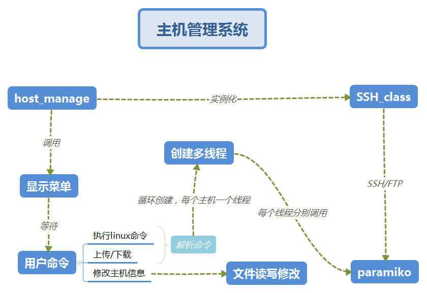

# 主机管理系统


使用paramiko模块编写的主机管理系统


------

## 实现功能

1. 列出主机组列表，用户选择主机组进行操作；

2. 主机组中多个主机多线程执行基本linux命令;

3. 多个主机多线程实现FTP上传下载；

4. 可新增主机组，新增主机，修改主机保存的地址、端口、登录用户名密码等信息。

   ​

-----

## 目录结构

```
│  
├─bin
│  │  main.py#程序主入口
│  └─__init__.py
│      
├─conf
│  │  conf.ini#配置文件
│  └─__init__.py
│      
├─core
│  │  host_manage.py#主机管理多线程和菜单类
│  │  ssh_class.py#paramiko处理类
│  └─__init__.py
│  
│          
├─data
│  │  group1.dat#主机信息数据
│  │  group_list.dat#主机组数据
│  └─ __init__.py
│      
└─log#日志文件，按日期存储，一天一个
        __init__.py
```

----

## 流程图




-----

## About Me
```python
myname = 'MC.Lee'
mylink = 'limich.cn'
```
[我的博客](https://limich.cn)
QQ:289959141
E-mail:limich@aliyun.com

[代码GitHub地址](https://github.com/limingchang/python_study_task.git)

[代码国内码云同步地址](https://git.oschina.net/limich/python_study.git)