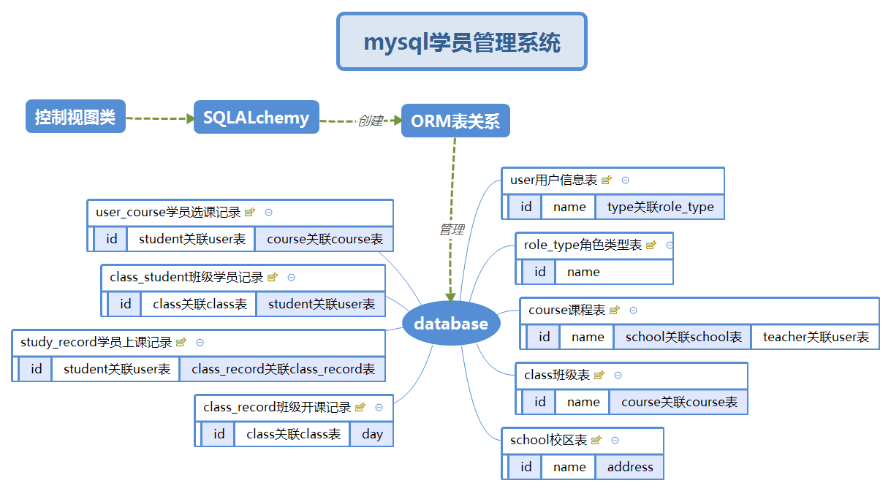

# mysql学员管理系统


## 实现功能

1. 用ORM对数据库进行管理
2. 按用户类型分别显示菜单，分为管理员、讲师、学员
```
管理员菜单
-创建学校
-创建课程=》创建过程关联讲师和学校
讲师菜单
-创建班级
-将学员加入班级
-给班级上课
-批改作业
学员菜单
-挑选课程
-提交作业
-查看成绩
```
3. 通过表外键关联实现数据的关联查询和反查
4. 测试注意
  - 请新建一个空数据库，分配管理账号，并将相关信息填入`conf/config.ini`配置文件
  - 系统初始化默认新建三个账户`lmc 123 学员` `sublime 123 讲师` `admin admin 管理员`
  - 请先以管理员登录创建学校和课程


------

## 文件结构

- 主目录`conf/confing.ini`文件存储配置信息
- `bin`目录为程序主入口
- `sql_class.py`为`SQLAlchemy`控制管理数据库类
- `view_class.py`为程序逻辑处理类，并包含控制视图

----

## 流程图（数据结构图）




------

## About Me
```python
myname = 'MC.Lee'
mylink = 'limich.cn'
```
[我的博客](https://limich.cn)
QQ:289959141
E-mail:limich@aliyun.com

[代码GitHub地址](https://github.com/limingchang/python_study_task.git)

[代码国内码云同步地址](https://git.oschina.net/limich/python_study.git)