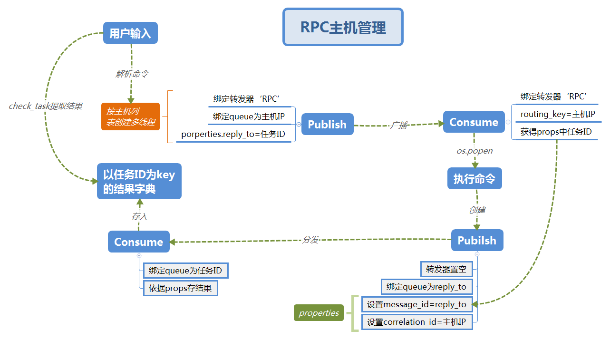

# RPC_RabbitMQ主机管理


## 实现功能

1. 用RabbitMQ实现主机管理
2. 客户端运行命令`run "命令" --host host_1_ip host_2_ip...`
3. 立即返回任务ID，用`check_task ID`获得执行结果
4. 多线程异步执行，不需要等待


------

## 文件结构

- `RPC_server`和`RPC_client`目录下各有一个`conf/confing.ini`文件存储配置信息
- `bin`目录为程序主入口
- 使用时上传服务端文件后，需修改配置文件中的本机IP，否则不能正常接收指令

----

## 流程图



- 通过转发器广播命令给主机，主机以任务ID为queue返回结果
- 结果获取为基本模式，设置`no_act = False`客户端获取结果通知`RbiitMQ`

------

## About Me
```python
myname = 'MC.Lee'
mylink = 'limich.cn'
```
[我的博客](https://limich.cn)
QQ:289959141
E-mail:limich@aliyun.com

[代码GitHub地址](https://github.com/limingchang/python_study_task.git)

[代码国内码云同步地址](https://git.oschina.net/limich/python_study.git)